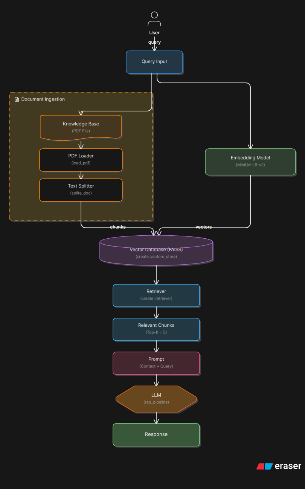

# RAG PDF Chatbot

[]()
[]()
[]()
[]()
[]()
[]()

---

## Overview

This project implements a Retrieval-Augmented Generation (RAG) system that allows users to upload PDF documents and ask natural language questions. The system retrieves relevant information from the document and generates answers strictly grounded in the provided context.

If the answer is not present in the document, the system explicitly responds with *"I don't know"*, preventing hallucinated outputs.

---

## 🏗️ Architecture & Workflow


---

## Demo

### Application Interface


### Response Example


The system allows users to:

* Upload a PDF document
* Ask questions in natural language
* Receive accurate, context-based answers

---

## 🏗️ Architecture & Workflow


---

## Key Design Decisions

* Context-restricted prompting to eliminate hallucination
* MMR retrieval to improve diversity and reduce redundancy
* In-memory FAISS indexing for simplicity and speed
* Modular separation between ingestion, retrieval, and generation

---

## Project Structure

```text
├── app.py              # Streamlit UI
├── rag_pipeline.py     # Document processing and retrieval setup
├── rag_brain.py        # Query → prompt → LLM response
├── llm_load.py         # LLM configuration (Groq)
├── requirements.txt
├── README.md
└── assets/
    ├── app_screenshot_1.png
    └── app_screenshot_2.png
```

---

## Setup

```bash
git clone https://github.com/your-username/rag-pdf-chatbot.git
cd rag-pdf-chatbot
pip install -r requirements.txt
```

Create a `.env` file:

```text
GROQ_API_KEY=your_api_key_here
```

Run the application:

```bash
streamlit run app.py
```

---

## Limitations

* Vector index is in-memory and rebuilt for each upload
* Supports a single PDF per session
* Chat history is not persisted

---

## Summary

This project demonstrates a practical implementation of a RAG pipeline using vector search and large language models to generate accurate, document-grounded responses. It highlights strong understanding of retrieval systems, prompt design, and real-time AI application development.

---

## Author

Aakash Kumar
B.Tech Computer Science (Data Science)
